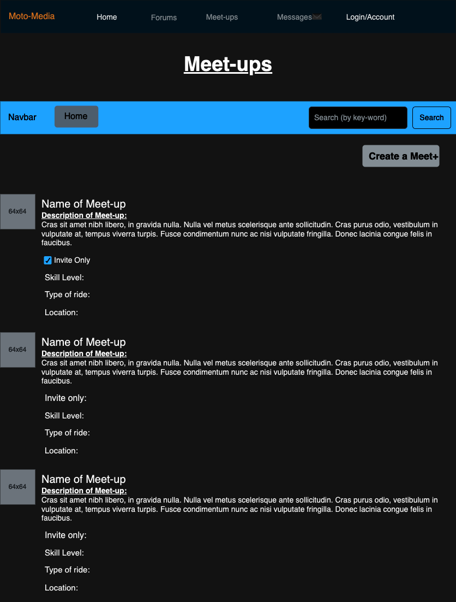

# Project Name: Moto-Media

### My web application Moto-Media will be a  website for people to post questions socialize and enjoy social media with other motorcycle riders of all levels. Users will be able to message others directly and push their riding skills to even higher levels even having the ability to post events known as "Meet-ups" or  "Ride-outs". My website will be responsive tailoring to users on all devices! The market for good apps in this realm is very slim if existing at all so I aim to create an app that is easy to use and worth signing up for. My stretch goals will be what makes this project stick out and i believe i can reach them in the next week.

## <u>WireFrames:
* ()
* 
* 
* 
* 
* 
* 
* 

## <u>ERDs:<u>
* 
* 
* 
  
## Technologies:

## <u>New Technologies:<u>
#### <u>Authorization, Levenshtein<>

## <u>Frontend:<u> 
#### React, Bootstrap, Axios, Flexbox, Grid, Html5, Vite

## <u>Middleware:<u>
#### Cors, AuthenticationMiddleware, SessionMiddleware, and more built in django middleware

## <u>Backend:<u>
#### Django Restful API

### <u>LinkedIn:<u>
#### https://www.linkedin.com/in/heriberto-cuellar-11758b303/